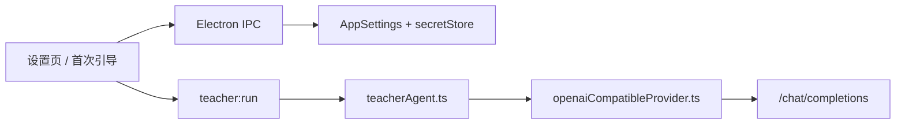
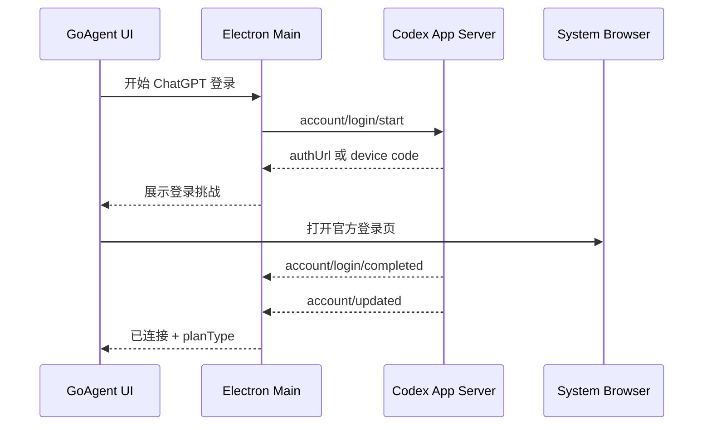

# 多模型与订阅登录接入方案

状态：Phase 0 / Phase 1 已实现；Phase 2+ 待实现

目标分支：`design/multi-provider-model-access`

适用版本：GoAgent `v0.4.20` 之后

## 实现记录（当前分支）

- 已加入 `LlmConnectionProfile`、active connection、版本化迁移和 connection-scoped API Key 存储；旧 `llmBaseUrl/llmApiKey/llmModel` 仍兼容。
- 已加入 provider registry，原 OpenAI-compatible 工具循环和新 Codex App Server provider 统一从 registry 调用。
- 已实现 ChatGPT 浏览器登录、账号状态、退出登录、多模态模型发现、文本/棋盘图片输入、流式讲解和取消。
- ChatGPT 入口先调用 `account/read` 复用 Codex Desktop/CLI 的共享登录缓存；仅在未登录时启动 OAuth。GoAgent 不读取 `auth.json` 或 token。
- Windows 包内携带官方 `@openai/codex` 平台 CLI 并从 `app.asar.unpacked` 启动，避免 PATH 解析到受保护的 Microsoft Store `WindowsApps` 可执行文件后触发 `spawn EPERM`。
- ChatGPT 模型完全来自 `model/list`，只展示支持图片的模型并优先采用服务端 `isDefault`；API Key 模式继续从 `/models` 动态刷新。旧的 `gpt-5-mini` 默认值迁移为 GPT-5.6 系列配置，不会串入 ChatGPT profile。
- ChatGPT provider 采用稳定接口：GoAgent 先确定性运行 KataGo、棋盘截图和知识匹配，再把事实与图片交给当前 provider 生成最终讲解；未启用实验性 dynamic tools。
- 设置中心和首次引导均可在 API Key 与 ChatGPT 登录之间切换；可为无法从 PATH 发现的环境指定 Codex CLI 路径。
- 已删除 `review:start`、`review.ts`、`review_game.py`、该脚本专用 Python runtime 与依赖入口。整盘/区间复盘统一进入 `teacherAgent`。
- Phase 2 的 Claude Code provider 尚未实现。

## 已验证场景

- 已使用 ChatGPT Pro 账号手工验证：`gpt-5.6-luna` 可完成 GoAgent AI 老师讲解。
- CI 不会执行真实账号登录；不同 ChatGPT 套餐、模型可用性和跨平台打包仍需要在发布前分别验证。

## 1. 背景与结论

GoAgent 当前把“模型供应商”“API 协议”和“鉴权方式”绑定在一组设置中：

```text
llmBaseUrl + llmApiKey + llmModel
```

这使 AI 老师只能通过 OpenAI-compatible `chat/completions` + Bearer API Key 工作。虽然项目已经定义了 `LlmProvider` 接口，但教学 Agent 主链仍直接调用 `streamOpenAICompatibleToolTurn`，尚未真正经过 provider registry。

本方案建议：

1. 保留现有 OpenAI-compatible API Key 接入，保证完全向后兼容。
2. 第一优先级新增“使用 ChatGPT 登录”，通过官方 Codex App Server 承载 OAuth、token 刷新、账号状态、模型发现和模型调用。
3. 第二优先级新增“使用 Claude Code 登录”，复用用户本机官方 Claude Code 的已登录会话；该接入先作为实验功能发布。
4. GoAgent 不实现 OpenAI/Anthropic 私有 OAuth，不读取 `~/.codex/auth.json`、系统钥匙串或 Claude Code 凭据，不复制 access token。
5. 把“是否可用”从 `hasLlmApiKey` 改为能力驱动的连接状态：文字、图片、工具、流式输出分别探测。

本文中的“Cloud Code”按用户语境理解为 **Claude Code**。

## 2. 已确认的官方能力边界

### ChatGPT / Codex

OpenAI 官方文档明确说明：Codex 本地客户端支持“使用 ChatGPT 登录”获得订阅访问，也支持 API Key 计量访问；Codex App Server 进一步提供：

- `account/login/start` 的 ChatGPT 浏览器登录和设备码登录；
- `account/read`、`account/logout` 和登录状态通知；
- 自动持久化与刷新 ChatGPT token；
- `model/list` 以及模型的 `inputModalities`；
- `turn/start` 的文字、远程图片和本地图片输入；
- 基于 JSON-RPC/JSONL 的流式事件；
- 实验性的 dynamic tools。

参考：

- [OpenAI authentication](https://developers.openai.com/codex/auth)
- [Codex App Server](https://developers.openai.com/codex/app-server)

因此 ChatGPT 登录不应被实现成“拿 OAuth token 后伪装 API Key 请求”。正确边界是：GoAgent 作为 App Server 客户端，模型请求也由 App Server 完成。

### Claude Code

Anthropic 官方文档明确说明 Claude Code 可使用 Claude Pro/Max 账号登录，并提供 `claude -p` 非交互模式、流式 JSON 输出和 MCP 工具配置。另一方面，Claude Code SDK 的程序化认证文档仍优先建议专用 API Key。

参考：

- [Set up Claude Code](https://docs.anthropic.com/en/docs/claude-code/getting-started)
- [Claude Code CLI reference](https://docs.anthropic.com/en/docs/claude-code/cli-usage)
- [Claude Code SDK](https://docs.anthropic.com/en/docs/claude-code/sdk)

因此 Claude Code 订阅桥接应满足两个约束：

- 只调用官方 CLI/SDK，不提取或转存凭据；
- 在完成许可、图片输入和 MCP 工具链的真实验收前保持 `experimental`，不可宣称与 API Key 路径完全等价。

## 3. 当前实现梳理

### 3.1 调用链



主要耦合点：

- `src/main/lib/types.ts`：`AppSettings` 只有 `llmBaseUrl/llmApiKey/llmModel`。
- `src/main/lib/store.ts`：secretStore 只保存单个 `llmApiKey`。
- `src/main/services/teacherAgent.ts`：直接 import OpenAI-compatible 工具轮次函数。
- `src/main/services/llm.ts`：探测和模型列表固定走 OpenAI-compatible。
- `src/main/services/review.ts`：Python 复盘子进程只会接收 API Key 参数。
- `src/main/index.ts` 与 preload：IPC 以“获取已保存 API Key”为中心。
- `src/renderer/src/App.tsx` 与首次引导：就绪条件写死为 `hasLlmApiKey`。
- diagnostics/systemProfile/tests/docs：都把“已连接模型”等同于“有 API Key”。

### 3.2 已有可复用能力

- `ChatMessage`、图片 content part、tool schema 和 `ChatTurnResult` 已形成内部雏形。
- 现有 provider 已支持文字、图片、工具和流式输出的三项探测。
- Electron 主进程已经承担 secret 隔离，renderer 默认拿不到完整密钥。
- teacher runtime 的工具执行、取消、进度和脱敏逻辑可以保留。

### 3.3 顺手发现的安全文档偏差

README 仍写“API Key 使用 Electron safeStorage”，而当前 `store.ts` 实际使用 app-local AES-256-GCM secret store，并明确不再解密旧 safeStorage 数据。实施时应同步修正文档，避免错误安全承诺。

## 4. 目标模型

把三个概念拆开：

| 概念 | 示例 | 说明 |
| --- | --- | --- |
| Provider | OpenAI-compatible、Codex App Server、Claude Code | 谁执行模型请求 |
| Auth mode | API Key、managed login、external CLI session | 凭据如何获得和维护 |
| Model | 具体模型 ID/别名 | 用户最终选择的模型 |

建议的新设置结构：

```ts
type LlmProviderId =
  | 'openai-compatible'
  | 'codex-app-server'
  | 'claude-code'

type LlmAuthMode =
  | 'api-key'
  | 'managed-login'
  | 'external-cli-session'

interface LlmConnectionProfile {
  id: string
  name: string
  providerId: LlmProviderId
  authMode: LlmAuthMode
  model: string
  endpoint?: string
  executablePath?: string
  enabled: boolean
  options: {
    reasoningEffort?: string
    timeoutMs?: number
    experimentalAgentTools?: boolean
  }
}

interface AppSettings {
  activeLlmConnectionId: string
  llmConnections: LlmConnectionProfile[]
  // 旧字段保留一个迁移周期，随后删除。
  llmBaseUrl: string
  llmApiKey: string
  llmModel: string
}
```

API Key 不进入 profile；secretStore 改为以 connection id 索引：

```text
llmCredentials.<connectionId>.apiKey
```

ChatGPT 和 Claude Code 连接只保存非敏感元数据，例如 provider、可执行文件路径、账号显示状态、最后验证时间；OAuth token 由官方客户端管理。

## 5. Provider Runtime 设计

现有 `LlmProvider` 应升级为真正的运行时边界，而不是只包装 chat：

```ts
interface ProviderCapabilities {
  text: boolean
  vision: boolean
  tools: boolean
  streaming: boolean
  modelDiscovery: boolean
  managedLogin: boolean
}

interface ProviderAuthState {
  status: 'connected' | 'disconnected' | 'expired' | 'unavailable' | 'unknown'
  accountLabel?: string
  planLabel?: string
  technicalDetail?: string
}

interface LlmProviderRuntime {
  id: LlmProviderId
  inspect(profile: LlmConnectionProfile): Promise<ProviderInspection>
  beginLogin?(profile: LlmConnectionProfile): Promise<LoginChallenge>
  cancelLogin?(loginId: string): Promise<void>
  logout?(profile: LlmConnectionProfile): Promise<void>
  listModels(profile: LlmConnectionProfile): Promise<LlmModelInfo[]>
  probe(profile: LlmConnectionProfile): Promise<ProviderProbeResult>
  runTurn(input: ProviderTurnInput): Promise<ChatTurnResult>
  cancel?(runId: string): Promise<void>
  dispose?(): Promise<void>
}
```

新增 `providerRegistry.ts`：

```text
connection profile
      |
      v
providerRegistry.resolve(providerId)
      |
      +-- openAICompatibleRuntime
      +-- codexAppServerRuntime
      +-- claudeCodeRuntime
```

`teacherAgent.ts` 只能依赖 `LlmProviderRuntime.runTurn()`，不得再 import 某一协议的具体函数。

## 6. 各接入方式

### 6.1 OpenAI-compatible API Key（稳定）

这是现有实现的平移和兼容层：

- 继续支持自定义 Base URL、API Key 和模型名；
- 保留 `/models`、文字、图片、tools 的实际探测；
- 保留参数兼容重试和流式降级；
- profile migration 自动创建名为“现有 API 配置”的连接；
- 后续可增加可选的自定义 header，但不放在第一期。

### 6.2 ChatGPT 登录 / Codex App Server（推荐新增）

#### 进程模型

Electron main 启动一个受管子进程：

```text
codex app-server --listen stdio://
```

通过 stdin/stdout 交换 JSONL。GoAgent 维护请求 id、pending promise、通知订阅、进程重启和退出清理。

#### 登录流程



优先使用 browser flow；回调不稳定、远程桌面或企业环境可切换 device-code flow。

#### 模型与多模态

- `model/list` 渲染模型选项，只显示 `inputModalities` 包含 `image` 的模型用于完整 AI 老师。
- 棋盘图通过 `turn/start.input` 的 image/localImage 项发送。
- 不把 data URL 直接落入日志；需要本地图片时写到 GoAgent 专用临时目录，结束后清理。
- 最终文字由 agent message delta 和 completed 事件聚合。

#### 工具策略

Codex App Server 的 dynamic tools 目前是实验 API，所以分两层交付：

1. 稳定 MVP：GoAgent 先按现有快速路径确定性执行 KataGo、知识检索和棋盘截图，再把完整证据交给 Codex 做单轮/多轮讲解。
2. 实验开关：将 GoAgent teacher tools 映射为 App Server dynamic tools，支持自由提问的 tool-first 运行时。

无论哪一层，Codex 线程都使用隔离的临时 cwd、restricted read access、无写权限、无网络工具权限和 `approvalPolicy: never`。GoAgent 只响应明确注册的教学 dynamic tools，不接受任意 shell/文件操作请求。

如果当前 App Server 版本无法满足上述隔离条件，应 fail closed：只允许确定性预取后的讲解，或将该 provider 标记为不可用。

### 6.3 Claude Code 登录（实验）

#### 发现和登录

- 查找官方 `claude` 可执行文件，展示路径和版本；允许用户手动指定路径。
- 未安装时只给官方安装指引，不由 GoAgent 静默安装全局包。
- 未登录时启动官方 Claude Code 登录体验；GoAgent 不接触凭据。
- 连接状态通过官方 CLI 的可用探测获得，不读取其凭据文件。

#### 调用

优先使用官方 SDK/CLI 的非交互流式模式：

```text
claude -p --output-format stream-json ...
```

为了保留 GoAgent 的 tool-first 能力，建议在 Electron main 内启动一个仅暴露教学工具的临时本地 MCP server，并通过临时 `--mcp-config` 交给 Claude Code：

```text
Claude Code
  -> mcp__goagent__katago_analyzePosition
  -> mcp__goagent__knowledge_search
  -> mcp__goagent__board_captureTeachingImage
  -> mcp__goagent__artifact_createTeachingArtifact
```

启动参数必须显式 allowlist GoAgent MCP 工具，并禁用 Bash、Write、Edit、WebFetch、WebSearch 等内置能力。MCP server 绑定 loopback/stdio，使用每次运行生成的高熵会话 token，退出时销毁临时配置。

#### 发布门槛

以下三项必须通过真实账号验收，否则 Claude Code provider 不进入 stable：

1. Pro/Max 登录态可在非交互调用中合法复用；
2. 棋盘 PNG 能稳定进入模型视觉上下文，而不是只把路径当文字；
3. MCP 工具调用、取消和流式输出在 Windows/macOS/Linux 均可控。

## 7. 能力矩阵与降级

| Provider | 登录 | 文字 | 图片 | 工具 | 模型发现 | 发布级别 |
| --- | --- | --- | --- | --- | --- | --- |
| OpenAI-compatible | API Key | 探测 | 探测 | 探测 | `/models` 或手填 | stable |
| Codex App Server | ChatGPT/API Key | 支持 | 按模型目录 | dynamic tools 为实验 | `model/list` | login stable / tools beta |
| Claude Code | Claude Pro/Max 或其支持凭据 | 待实测 | 待实测 | MCP | CLI 别名/配置 | experimental |

每个功能声明自己的最低能力：

```text
普通问答            text
当前局面视觉讲解    text + vision
自由 Agent 任务     text + tools (+ vision when required)
```

连接不满足要求时必须明确提示缺少哪项能力，不可统一显示“API Key 未配置”。

## 8. UI / UX

“设置 > AI 模型”改成连接卡片：

```text
[ 使用 ChatGPT 登录 ]  推荐
  未连接 / 已连接 user@example.com · Plus
  [登录] [选择模型] [验证] [退出]

[ 使用 Claude Code ]   实验
  未安装 / 未登录 / 已连接
  [查看安装指引] [登录] [选择模型] [验证]

[ 使用 API Key ]
  OpenAI-compatible Base URL / API Key / Model
  [刷新模型] [验证]
```

首次引导同样提供三种入口，并将“稍后配置”保留。就绪条件改为：

```ts
auth.status === 'connected' && requiredCapabilitiesPassed
```

测试结果继续分别展示：

- 文字回复；
- 棋盘图片；
- Agent 工具；
- 登录状态和计划类型；
- provider 版本/协议版本。

renderer 不接收 API Key、OAuth token、CLI credential path 或原始鉴权响应。

## 9. IPC 变更

建议新增：

```text
llm:providers:list
llm:connections:list
llm:connections:save
llm:connections:delete
llm:connections:activate
llm:auth:inspect
llm:auth:login-start
llm:auth:login-cancel
llm:auth:logout
llm:models:list
llm:probe
```

事件：

```text
llm:auth:changed
llm:auth:login-progress
llm:provider:status
```

删除 renderer 读取完整 API Key 的常规路径。若继续保留“显示 Key”，应单独做用户确认和审计；更建议只提供“替换/清除 Key”。

## 10. 数据迁移

应用启动时执行幂等迁移：

1. 如果没有 `llmConnections`，从旧字段创建 `openai-compatible` profile。
2. 将现有 secretStore 的 `llmApiKey` 移到新 connection id 下。
3. 设置 `activeLlmConnectionId`。
4. 旧字段保留一个发行周期供回滚读取，但不再作为主写入源。
5. 第二个发行周期删除旧字段和 `hasLlmApiKey`，替换为 `activeLlmConnectionStatus`。

不要自动把已登录 Codex/Claude 账号加入 GoAgent；必须由用户在 UI 中明确选择连接，以形成清晰的数据发送同意。

## 11. 其他调用路径的处理

`src/main/services/review.ts` 当前把 API Key 传给 `scripts/review_game.py`。登录型 provider 无法复用这条路径。

建议将职责拆成：

1. Python/KataGo 只生成确定性的分析 JSON；
2. Electron main 再通过 active provider 做讲解总结；
3. 报告合并回现有 artifact。

这样所有讲棋入口都经过同一个 provider runtime，也避免把 OAuth/CLI 会话传进 Python 子进程。

## 12. 安全与隐私要求

- 不读取、复制、打印或备份 Codex/Claude Code credential 文件。
- 不把 OAuth token 经过 renderer、日志、错误消息、报告或 teacher tool result。
- API Key 继续只在 main process 使用，并迁移到 connection-scoped secret。
- 登录必须由用户主动触发，退出必须调用官方 provider 的 logout，而不是只清本地状态。
- 所有子进程使用参数数组，不通过拼接 shell 命令启动。
- 临时 PNG、MCP 配置和 JSONL 日志放在 GoAgent 专用临时目录，权限最小化并可回收。
- provider 崩溃后清理 pending requests、临时文件和本地监听端口。
- 日志只记录 provider id、模型、能力、耗时、错误码；不记录 prompt、棋盘 base64 和账号 token。
- 设置页明确提示棋盘截图、KataGo 数据、知识摘录会发送给当前选中的服务。

## 13. 实施阶段

### Phase 0：抽象与兼容（必须先做）

- 新 profile schema、迁移和 provider registry；
- OpenAI-compatible adapter 平移；
- teacherAgent、llm.ts、diagnostics、onboarding 全部改用连接/能力状态；
- 拆除 Python LLM 直连；
- 现有测试全部通过。

### Phase 1：ChatGPT 登录 MVP

- Codex App Server 生命周期与 JSON-RPC client；
- browser/device-code 登录、账号状态、退出；
- 模型列表、图片输入、流式讲解、取消；
- 确定性预取的 AI 讲棋路径；
- Windows/macOS/Linux 冒烟测试。

### Phase 2：ChatGPT Agent tools beta

- dynamic tools 映射；
- 工具调用回传、超时、取消和 fail-closed 隔离；
- 自由提问路径真实验收；
- 通过 feature flag 灰度。

### Phase 3：Claude Code experimental

- CLI 发现/登录状态/非交互桥；
- 临时 MCP server 与工具 allowlist；
- 图片输入 POC；
- 订阅账号和三平台验收；
- 根据官方支持边界决定是否升为 stable。

## 14. 测试计划

### 单元与契约测试

- profile schema、旧设置迁移、secret 重键；
- registry 路由，确保 teacherAgent 不再 import 具体 provider；
- Codex JSONL 分帧、乱序响应、通知、进程退出、重连；
- auth challenge、取消、超时、logout；
- model capability 过滤；
- 图片临时文件生命周期；
- Claude stream-json 解析和 MCP allowlist；
- 所有错误与日志的 secret redaction。

### 模拟集成测试

为三个 provider 分别构造 fake server/process：

- 文字成功、图片失败、工具失败的独立能力状态；
- token 过期/401 后由官方客户端刷新；
- 子进程崩溃、半行 JSON、超大事件、取消竞态；
- 登录未完成时关闭设置页/退出应用。

### 真实验收

- ChatGPT Plus/Pro/Business/Enterprise 中至少两个实际计划；
- Claude Pro/Max；
- Windows/macOS/Linux；
- 当前手、整盘总结、自由提问、取消、连续多轮；
- 核对账号用量/限额提示和隐私说明。

## 15. 验收标准

1. 现有 API Key 用户无感升级，原设置和模型继续可用。
2. 用户可只用 ChatGPT 登录完成一次带棋盘图片的讲棋，不填写 API Key。
3. renderer、日志和报告中不存在 OAuth token 或完整 API Key。
4. provider 切换不需要重启应用，运行中的任务使用启动时冻结的 connection snapshot。
5. 文字/图片/工具三项能力分别显示并分别阻断对应功能。
6. provider 进程退出或登录过期时给出可恢复提示，不丢棋谱和学生数据。
7. Claude Code 在三项发布门槛未满足前始终带“实验”标识。

## 16. 推荐决策

- **立即实施**：Phase 0 + Phase 1。
- **保留现有能力**：OpenAI-compatible API Key 始终是稳定 fallback。
- **不自行做 OAuth**：ChatGPT 走 Codex App Server 托管登录；Claude 走官方 Claude Code 登录态。
- **工具调用分级**：Codex dynamic tools 先 beta，快速讲棋先用确定性预取保证稳定。
- **Claude Code 后置**：先做真实 POC，再决定 stable，不以读取 token 或调用未公开接口换取表面可用。
